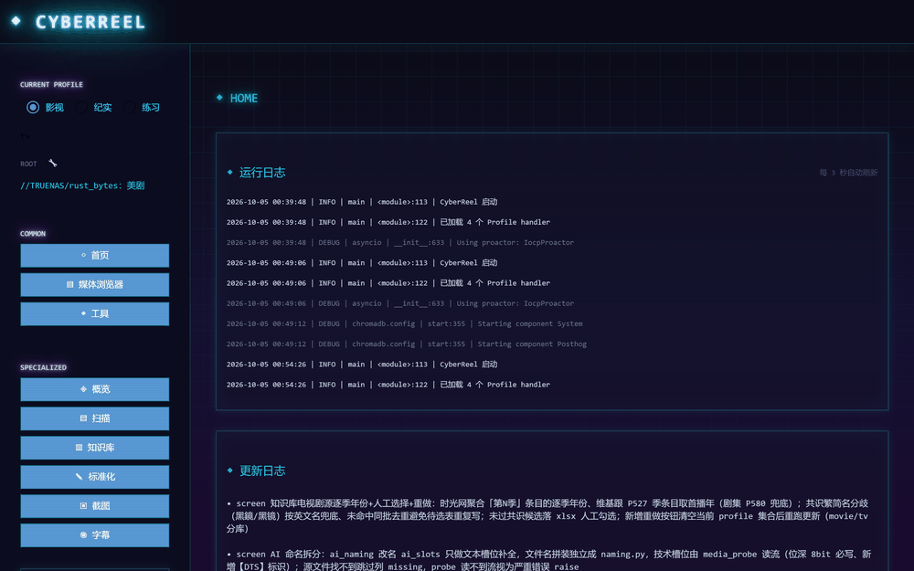

# CyberReel

基于 NiceGUI 的本地影视库管理工具，赛博朋克霓虹风格。扫描本地媒体 → AI 提取 / 规范化命名 → 外源补齐元数据 → 截图 / 字幕，一站式整理影视文件。



## 功能

- **扫描**：From / To / Root 三目录对比数据库并同步（电影按顶层文件、电视剧按顶层文件夹），记录来源。
- **知识库**：AI 提取中英文片名，综合 TMDB / 时光网 / 维基 / 豆瓣自动补齐年份、评分、季数、完结状态，支持人工勾选修正。
- **标准化**：AI 补全命名槽位后按统一规则拼装重命名（分辨率 / 音轨 / 位深 / 字幕类型等）。
- **截图**：PyAV 抽帧入库，均分或指定时间点。
- **字幕**：射手搜索中英双字下载，封装进视频并加类型后缀。

## 技术栈

NiceGUI · SQLite · ChromaDB · LangChain-DeepSeek · PyAV · Pillow

## 快速开始

```bash
python -m venv .venv
.venv/Scripts/python.exe -m pip install -r requirements.txt
.venv/Scripts/python.exe main.py
```

打开 http://127.0.0.1:8080

## 数据源 / Key

| Key | 设置位置 | 说明 |
| --- | --- | --- |
| DeepSeek | 概览页 | AI 提取片名 / 命名必需 |
| TMDB / TVDB | 知识库页 | 可选，缺失时走时光网 / 维基兜底 |
| 射手字幕 Token | 字幕页 | 搜索下载字幕必需 |

## 目录结构

```
main.py                入口（NiceGUI 启动 + 全局霓虹主题）
ui/                    NiceGUI 界面层（布局 / 状态 / 各页面）
workspaces/screen/     影视域业务逻辑（扫描 / 知识库 / 标准化 / 截图 / 字幕）
core/                  数据库 / 日志
tools/                 工具脚本（preview_gif.py 生成预览 GIF）
```

## 数据存储

- `data.db` — SQLite 媒体记录
- `workspaces/*/knowledge_base/storage/` — ChromaDB 知识库
- `workspaces/*/overrides.json` — 各 Profile 配置（含密钥）
- `logs/` — 运行日志（app.log 全量 + info/warning/error 分级）
